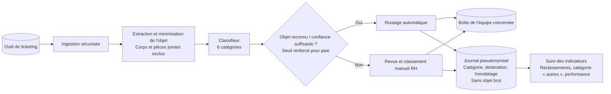

# Schéma d’architecture cible — tri des mails RH

**Composants** : ticketing, extraction de l’objet, classifieur, contrôle, routage ou revue, journal et suivi.

**Choix à confirmer** : objets préformattés par l'outil de ticketting. Format et suffisance à valider.

**Écartés en v1** : corps, pièces jointes, LLM, API externe, RAG et base vectorielle. L’objet peut contenir des données personnelles : ne pas le conserver dans les journaux.
