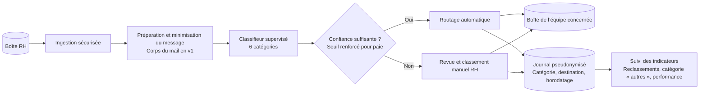

# Schéma d’architecture cible — tri des mails RH

**Composants** : boîte RH, ingestion sécurisée, préparation du message, classifieur supervisé, contrôle de confiance, routage ou revue manuelle, boîtes des équipes, journal pseudonymisé et suivi des indicateurs.

**Éléments écartés en v1** : LLM et API externe, car un classifieur supervisé répond au besoin avec les tickets labellisés disponibles et évite l’exposition aux injections de consignes. Pas de RAG ni de base vectorielle, inutiles pour le routage. Les pièces jointes ne sont pas analysées en v1 ; ce périmètre reste à confirmer avec le client.
